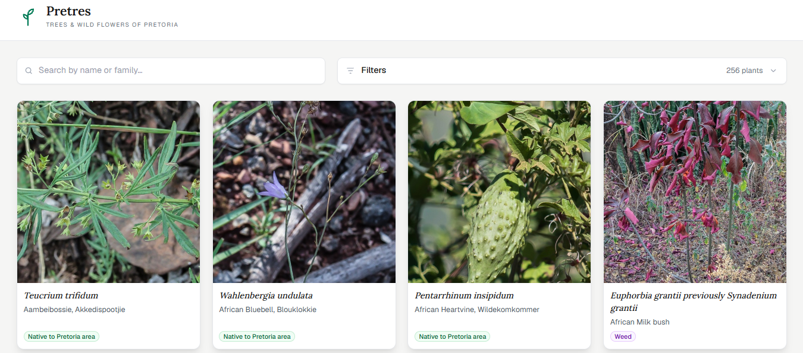

# Pretres

**Trees & Wild Flowers of Pretoria** — a public reference site cataloguing the indigenous, introduced, and invasive plant species found in and around Pretoria's nature reserves.

**Available at:** [pretres.co.za](https://pretres.co.za).

> **Note (September 2026):** Airtable's API quota for the month is exhausted, so until 1 October the site is built from a snapshot of the plant text taken on 13 September. Edits made in Airtable since then won't appear until the quota resets. Photos are unaffected. They now come from Cloudflare R2 (see [Photos](#photos)).

## Screenshots



## Features

- **Browse & search** — every plant in one grid, searchable by scientific name, common name, or family.
- **Filter & sort** — filter by conservation status (native, invasive, weed, etc.) and flower colour; sort alphabetically by scientific or common name.
- **Plant detail pages** — family, conservation status, flower colour, the meaning of the scientific name, a description, and control notes for invasive species.
- **Photo gallery** — a display of photos with keyboard (arrow keys, Esc) and click navigation.

## Stack

- [Next.js](https://nextjs.org) (App Router) + TypeScript
- [Tailwind CSS](https://tailwindcss.com)
- [Airtable](https://airtable.com) as the content source
- [Cloudflare R2](https://developers.cloudflare.com/r2/) for photos

## Architecture notes

- Data fetching is centralised in [`lib/airtable.ts`](lib/airtable.ts). `getPlants()` pages through the entire Airtable table. `getGridPlants()` and `getPlant()` both build on it.
- Plant pages are fully static. `generateStaticParams` in [`app/plants/[id]/page.tsx`](app/plants/[id]/page.tsx) prebuilds every plant at build time, so visiting one serves a static file.
- Search, filtering, and sorting runs client-side. [`app/page.tsx`](app/page.tsx) fetches the full plant list at build time and passes it as a prop. [`app/plant-grid.tsx`](app/plant-grid.tsx) filters/searches/sorts that list in the browser. The only part that can't be built ahead of time is the initial filter state, since it comes from the URL's query string. So the grid itself renders in the browser, where it reads the query string, using plant data that's already in the page.
- Photos are served from Cloudflare R2, not from Airtable. [`data/photos.json`](data/photos.json) maps each plant's record ID to its photos, and [`lib/photos.ts`](lib/photos.ts) turns those into URLs. Nothing about photos touches Airtable at build time.
- The site is rebuilt on Vercel via a deploy hook triggered by [cron-job.org](https://cron-job.org), so edits made in Airtable show up without a manual deploy.

## Photos

Airtable's attachment URLs expire after about two hours. Keeping them fresh took hourly rebuilds, and that used up Airtable's free API quota. So in September 2026 every photo was copied once to Cloudflare R2 and served from `img.pretres.co.za`. Those URLs never expire.

The photo set is fixed. The Airtable base is at its attachment limit, so no new photos can be added.

## Getting started

### Prerequisites

You need an Airtable base with a table of plants. See [Airtable schema](#airtable-schema) below for the fields the app expects.

### Environment variables

Create a `.env.local` file in the project root:

```bash
AIRTABLE_TOKEN=your_personal_access_token
AIRTABLE_BASE_ID=your_base_id
AIRTABLE_TABLE=your_table_name
NEXT_PUBLIC_PHOTO_BASE=https://img.pretres.co.za
```

- `AIRTABLE_TOKEN` — a [personal access token](https://airtable.com/create/tokens) scoped to `data.records:read` on the base.
- `AIRTABLE_BASE_ID` — the base ID (starts with `app...`).
- `AIRTABLE_TABLE` — the exact table name (or table ID).
- `NEXT_PUBLIC_PHOTO_BASE` — the address that the photo keys in `data/photos.json` are added to. It's public, since the browser loads the images directly. The same hostname is allowed in [`next.config.ts`](next.config.ts).

### Install & run

```bash
npm install
npm run dev
```

Open [http://localhost:3000](http://localhost:3000).

## Airtable schema

The app reads these fields from the configured table (see [`lib/fields.ts`](lib/fields.ts)):

| Field | Type | Used for |
| --- | --- | --- |
| `Scientific Name` | text | Title, search, default sort |
| `Common Names` | text | Subtitle, search, alternate sort |
| `Family` | text | Detail page, search |
| `Status` | single select | Status badge, filter (e.g. *Native to Pretoria area*, *Listed Invasive*, *Weed* — see [`lib/status.ts`](lib/status.ts) for the full list and styling) |
| `Flower colour` | single select | Colour badge, filter (see [`lib/flower-colours.ts`](lib/flower-colours.ts) for the recognised values) |
| `Meaning of Scientific name and synonyms` | long text | Detail page |
| `Description` | long text | Detail page |
| `Notes` | long text | Detail page (e.g. control/eradication notes for invasives) |

## Deployment

Deployed on Vercel. Set the three `AIRTABLE_*` variables and `NEXT_PUBLIC_PHOTO_BASE` in the Vercel project settings. To pick up Airtable edits, point a cron trigger (e.g. [cron-job.org](https://cron-job.org)) at the project's deploy hook. Once a day is plenty now that photo URLs don't expire. Each build costs a few Airtable API calls, so an hourly schedule would use up the free tier's 1,000 calls a month.
